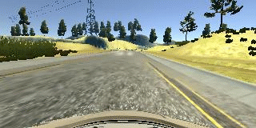
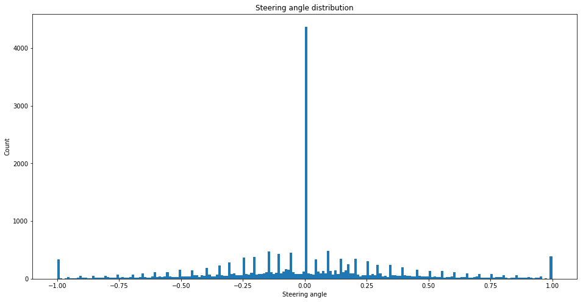
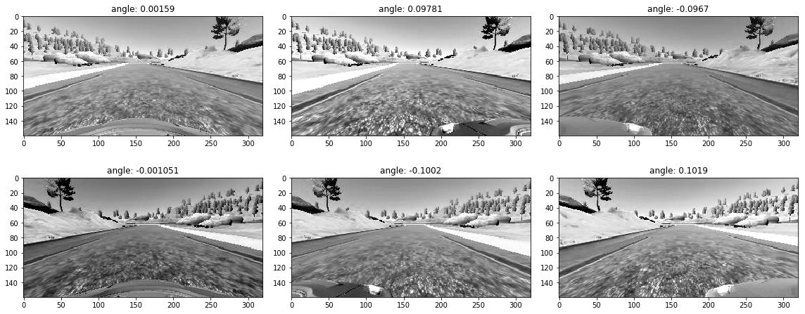
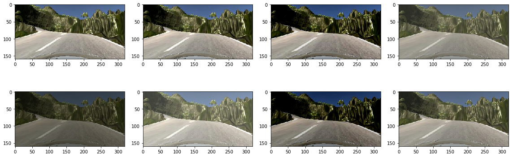
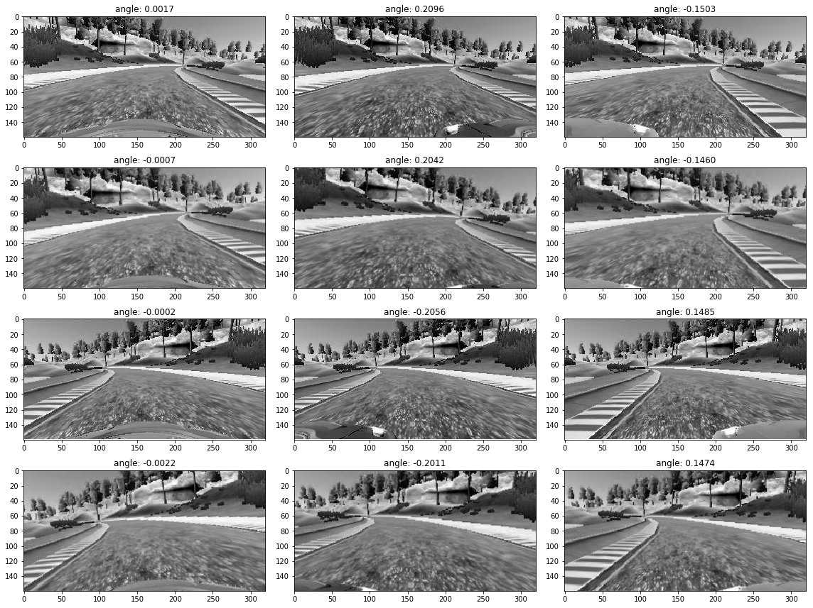
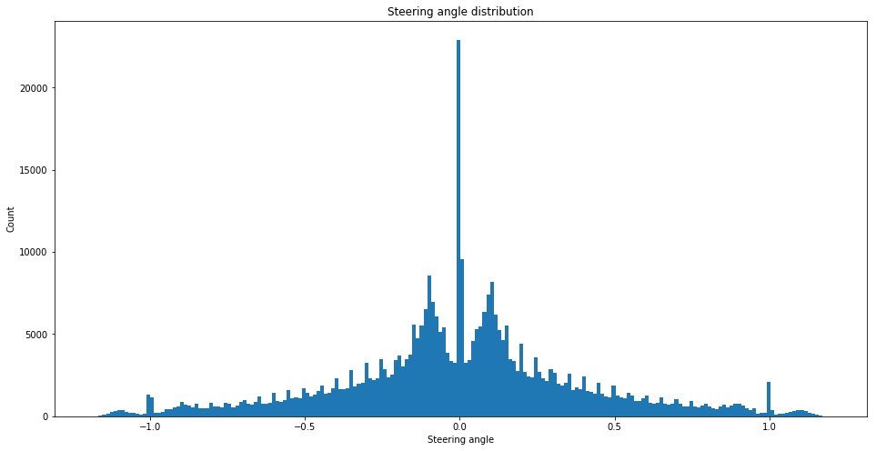
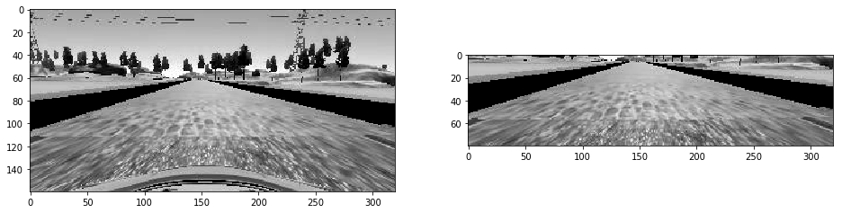
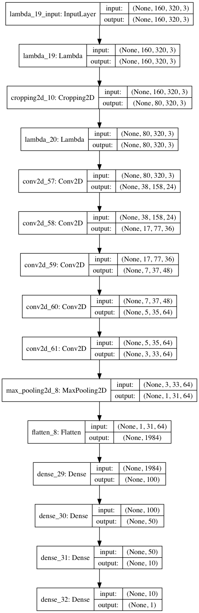
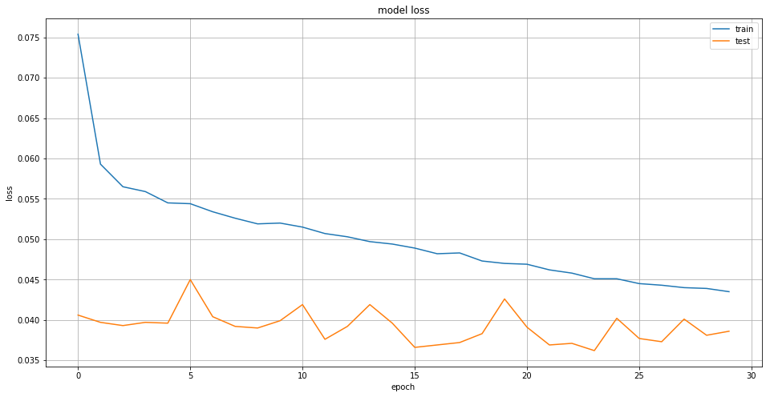

# Behavioral Cloning Project
[](http://www.udacity.com/drive)

The goals / steps of this project are the following:
* Use the simulator to collect data of good driving behavior
* Build, a convolution neural network in Keras that predicts steering angles
  from images
* Train and validate the model with a training and validation set
* Test that the model successfully drives around track one without
  leaving the road
* Summarize the results with a written report
---

## Project structure

The project includes the following files:
* `model.py` - containing the script to create the model
* `train.py` - containing the script to train the model
* `valid.py` - containing the script to validate the model
* `drive.py` - for driving the car in autonomous mode
* `model.h5` - containing a trained convolution neural network
* `registry.py` - containing helper class for handling driving log
* `reader.py` - banch of helper classes to iterate through data points
* `repository.py` - helper class the provides git-like filesystem layout for
  huge directories
* `generator.py` - core routines for data generation
* `pipeline.py` - pipeline definition for training and validation
* `cvutils.py` - bunch of routines used in data augmentation
* `README.md` - project quick overview and summarizing the results

## Usage
### Training
Model can be trained using following command

```sh
python train.py -t dataset/driving_log.csv model.h5
```

Input:
  *  _dataset/driving_\__log.csv_ - path to driving log
  *  _model.h5_ - path to model

Output:
  * _model.checkpoint_ - directory containing model snapshot for each epochs
  * _model.test.csv_ - fraction of original driving log which was not used in
    training process, could be used for validation
  * _model.history.p_ - pickled version of training history

### Validation
Model performance could be measured by following command

```sh
python train.py -v dataset/model.test.csv model.h5
```

Input:
  * _dataset/model.test.csv_ - validation data set
  * _model.h5_ - model

Output:
  * _loss_ - will be printed on console

### Driving
Using the UdaCity provided simulator [1] and my `drive.py` file, the car can be
driven autonomously around the track by executing

```sh
python drive.py model.h5 [output]
```

## Model Architecture and Training Strategy

### Solution Design Approach

The overall strategy for deriving a model architecture was to:
*  Collect relevant training data
*  Analyze collected data to better understand it
*  Preprocess and normalize collected data
*  Use appropriate data augmentation techniques
*  Tune network parameters in order to achieve the best performance
*  Validate model on the simulator

My first step was to use a convolution neural network model similar to the one
described in [2]. I thought this model might be appropriate because the original
work was focused on the similar task.

In order to gauge how well the model was working, I split my image and steering
angle data into a training, validation, and test sets. See data analyze section
for details.

At the end of the process, the vehicle is able to drive autonomously around
the track without leaving the road.

### Appropriate training data

Training data was chosen to keep the vehicle driving on the road. I used a
combination of center lane driving in forward and backward direction,
recovering from the left and right sides of the road.

#### Creation of the Training Set

To capture good driving behavior, I first recorded three laps on track one
(lake) trying to keep center lane driving. Here is an example image of center
lane driving:


I then recorded the vehicle recovering from the right side and left sides of
the road back to center so that the vehicle would learn how to fix position on
a road. This animation shows what a recovery looks like starting from left side:



Next I recorded three laps on track one of center lane driving in opposite
direction.

Then I repeated this process on track two (jungle) and track three (castle,
found in previous version of simulator) in order to get more data points.

After the collection process, I had _53688_ data points. The data points were
divided to training, validation and test sets (randomly shuffled).
The actual numbers are

| Name           | %   | # of points |
|----------------|-----|-------------|
| Training set   | 70% | _37581_     |
| Validation set | 12% | _6442_      |
| Test set       | 18% | _9665_      |

#### Quality of the Data

Raw data distribution presented on figure below. Note logarithmic scale.


'Straight driving' pattern was over represented in the data, which may lead to
biased network which unable to steer. In order to prevent high 'go straight'
bias I filtered out 80% (the parameter chosen experimentally ) of data points
with _0_ steering angle.
The distribution changed to the following (still over represented, but better).



#### Augmentation of the Data

Bellow I described augmentation techniques used in the project.

##### Image flipping

In order to obtain more data points in a safe way images were flipped around
y-axis, steering angle changed sign. The technique makes sense since it
produces valid (which may be captured by camera) image and appropriate steering
angle. This technique might lead to model overfitting since representation of
some features doubled.



##### Images from Side Cameras

The simulator provides two additional (left and right) images for each data
point. This images may be used in training process. The biggest problem is to
find appropriate steering angle correction. Also one have to keep in mind the
correction angle will be over represented in the data (since 'go straight') is
over represented.
After several experiments with static and random correction angles, I choose
correction angle to be _normally distributed with mu=0.1, sigma=0.03_.
Randomization in my opinion should reduce chance of overfitting.

##### Random Brightness and Contrast

Another possible augmentation technique - random brightness and/or contrast
adjustment. Using this technique allows model to learn how to deal with
different light conditions (sun sets, mid-days, shadows). Randomization reduces
chance of overfitting.

I used brightness adjustment with uniform distributed in range _[-20, 20]_.



##### Rotation (Roll)

Rotation could be used to produce more data. For example slightly rotated images
could help the network to learn how to drive in hilly environment
(ie. jungle track).

##### Steering Angle Randomization

The thing a believe helps a lot with fighting against overfitting - steering
angle randomization. The nature is continuous. In most cases small
change of value will not change final behavior, but will allow to smooth
data distribution.
I my experiments I used normally distributed randomization with
_mu=originalAngle and sigma=0.003_

##### Pipeline

Training data grooming pipeline
1. Angle adjustment for images from left and right cameras
2. Flipping images
3. Random brightness adjustment
4. Generating N (_2_ in my case) additional images using rotation
5. Angle randomization

Sample of all images generated from one data point (N=1):



Data distribution after pipeline:



#### Preprocessing

Each image pass the following preprocessing steps before feeding into the
network (some steps implemented as lambda layers)

##### Colorspace Conversion

All images converted to YUV colorspace as proposed in [2].

##### Crop

Since top of each images shows sky and landscape (which is not much useful
for the task) and bottom shows parts of the car. Obvious decision is to crop
the image in order to reduce size (less to data to process) and focus network
on useful details.



##### Normalization

Each channel of an image normalized in order to have value in range _[-1, 1]_.

### Model

The final model architecture (`model.py`) consisted of a convolution
neural network with the following layers and layer sizes

| Layer    | Input       | Output     | Kernel | Filters | Stride | Activation |
|----------|-------------|------------|--------|---------|--------|------------|
| Cropping | (160, 320, 3) | (80, 320, 3) |        |         |        |        |
| Lambda   | (80, 320, 3)  | (80, 320, 3) |        |         |        |        |
| Convolution  | (80, 320, 3)  | (38, 158, 24) | (5, 5) | 24 | (2, 2) | ReLU |
| Convolution  | (38, 158, 24) | (17, 77, 36)  | (5, 5) | 36 | (2, 2) | ReLU |
| Convolution  | (17, 77, 36)  | (7, 37, 48)   | (5, 5) | 48 | (2, 2) | ReLU |  
| Convolution  | (7, 37, 48)   | (5, 35, 64)   | (3, 3) | 64 | (1, 1) | ReLU |
| Convolution  | (5, 35, 64)   | (3, 33, 64)   | (3, 3) | 64 | (1, 1) | ReLU |
| MaxPooling   | (3, 33, 64)   | (1, 31, 64)   | (3, 3) |    | (1, 1) |      |
| Flatten      | (1, 31, 64)   | 1984          |        |    |        |      |
| Dense        | 1984          | 100           | | | | ReLU   |
| Dense        | 100           | 50            | | | | ReLU   |
| Dense        | 50            | 10            | | | | ReLU   |
| Dense        | 10            | 1             | | | | Linear |



All layers except the output use ReLU activation to introduce nonlinearity.
The model includes ReLU layers to introduce nonlinearity.
Model uses Keras cropping and lambda layers in order to prepare (crop and
normalize) input data.

There is no dropout layer in the model, see next section for thoughts about
overfitting/underfitting.

### Training Process
I used this training data for training the model.
  *  Loss function - mean squared error - reasonable choice for regression model
  *  Optimizer - Adam - adaptive learning rate simplifies learning and reduces
     number of hyper parameters
  *  Batch size - 768 - when using AWS/Azure high performance servers for
     training there is no limitation on RAM, and batch size could be chosen
     as big as graphics card memory size allows, since transferring data between
     RAM and graphics card memory could become a bottleneck.
  *  Number of epochs - 30

Learning curve for training:



Key observations and potential explanations:
  * Model seems to be under trained - loss on training set keep going down. On
    other hand loss on validation set doesn't change a lot. This could be a
    sign of overfitting, so stopping at reasonable number of epochs good enough.
  * Even without dropout or other regularization techniques model doesn't look
    overfitted. In my opinion reasons are
      *  Relatively small number of parameters
      *  Massive randomization of input and measurement
      *  Huge disproportion of 'go straight' is good in fact. The network seems
         new examples from this category each epoch

The validation set helped determine if the model was over or under fitting.
Finally test data helped to determine real model performance.

The model was tested by running it through the
simulator and ensuring that the vehicle could stay on the track.

## Potential Improvements
* Generate train data batches with GPU, currently CPU used
* Generate train data batches using multiprocessing, single core used currently

## Data Set
| Name | Link |
|------|------|
| UdaCity training data       | https://mega.nz/#!V9tASADT!TV_YZUTJi9pNRUG1j7Raev0oK3KbUgszAJkKKxOiXL8 |
| Track 01 forward direction  | https://mega.nz/#!Z0dhDITD!XWJcWTTS9-67PndO2cgstjxdJcoaTEGY9yohW3geD8Y |
| Track 01 backward direction | https://mega.nz/#!RxNwkbza!BzeH7kLL133YO2CbUQUMMDCdsGe3q_Z_N7FoaAOBcDU |
| Track 01 random samples     | https://mega.nz/#!18ciRCzR!_6Pu0JHbsEi2gn8PmHTJPEK8EsPsX2jorCoGY3qExIU |
| Track 02 forward direction  | https://mega.nz/#!xs9H3Yqa!82WpBN9cZIYMKaV9_hFgi4pqnP2Xiy6jlWJN-dKvssE |
| Track 02 backward direction | https://mega.nz/#!048UlLgI!CBciscwULl_zYg4H3btm95XU0WJKxGFgGvJ3SrE5JbM |
| Track 02 random samples     | https://mega.nz/#!NhkhUIqL!S-TvoKj_y4C8Gmt_FsxRVN15XUPPcEbfQ_emSvJVLYQ |
| Track 03                    | https://mega.nz/#!VgMGXZSL!iT-DiEYqiVcZjZ8F-34C8b01bhT3C6Av4i8_TUpOY6s |

## Video
| Track               | Car View                      | Simulator View                |
|---------------------|-------------------------------|-------------------------------|
| track01 - lake      | <https://vimeo.com/234067418> | <https://vimeo.com/234067436> |
| track02 - jungle    | <https://vimeo.com/234067565> | <https://vimeo.com/234067584> |
| track03 - mountains | <https://vimeo.com/234067698> | <https://vimeo.com/234067714> |

## Reference
1. Udacity's Self-Driving Car Simulator
   <https://github.com/udacity/self-driving-car-sim>
2. Bojarski, M., Del Testa, D., Dworakowski, D., Firner, B., Flepp,
   B., Goyal, P., Jackel, L. D., Monfort, M., Muller, U., Zhang, J.,
   et al. (2016). End to end learning for self-driving cars.
   arXiv preprint arXiv:1604.07316.
